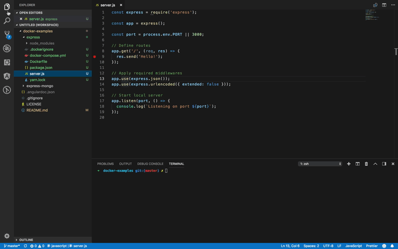

# Simple Docker Examples

My Docker playground examples, written for learning purposes.
Tested on MacOS. (Feel free to open a PR if you are using other platform)
_Warning: may not be suitable for production use._

## What's in the box

Currently, each example uses [nodemon](https://github.com/remy/nodemon) for:

1. Debugging
1. Watching files and live reload the app

## Debugging with vscode

## Todo

1. Add documentation about parameters used in Dockerfile and docker-compose.yml.
1. Explain about the first example.
1. Disable watch for unwanted files.
1. Examples to add:
   - Angular container
   - Express only configuration
   - Laravel container

## Resources

1. [Official NodeJS Debugging Guide](https://nodejs.org/en/docs/guides/debugging-getting-started/)
